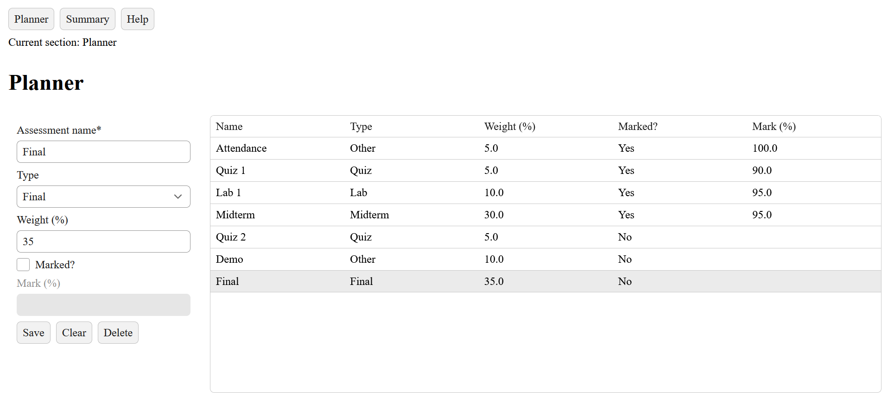
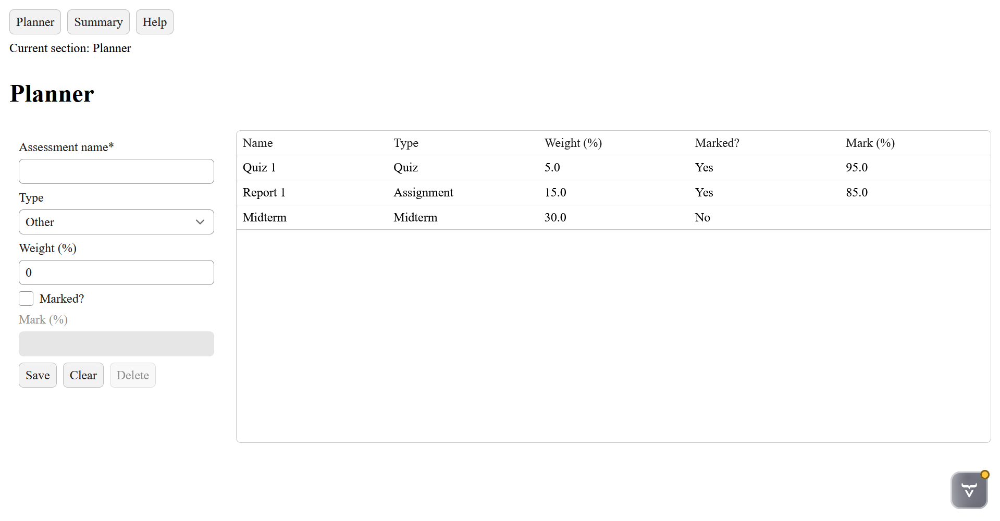
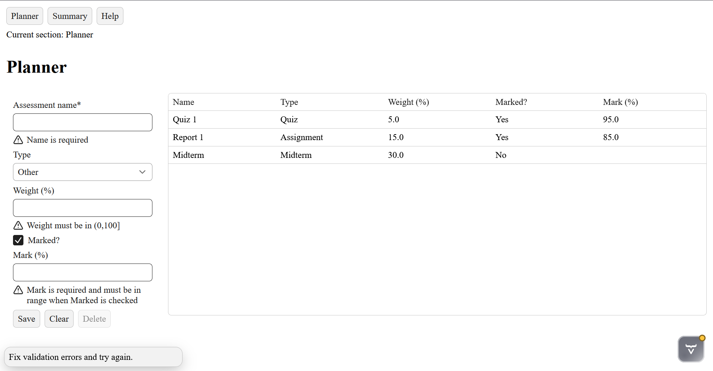
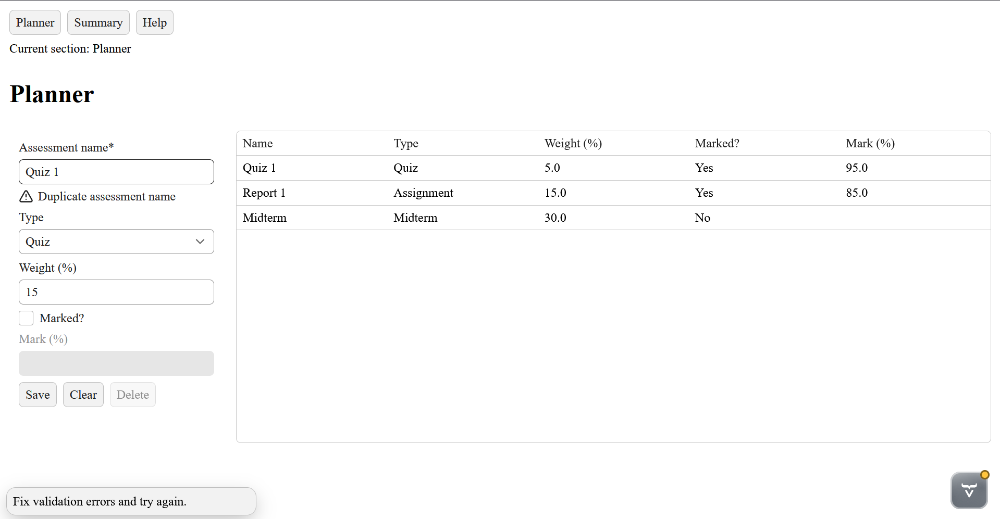
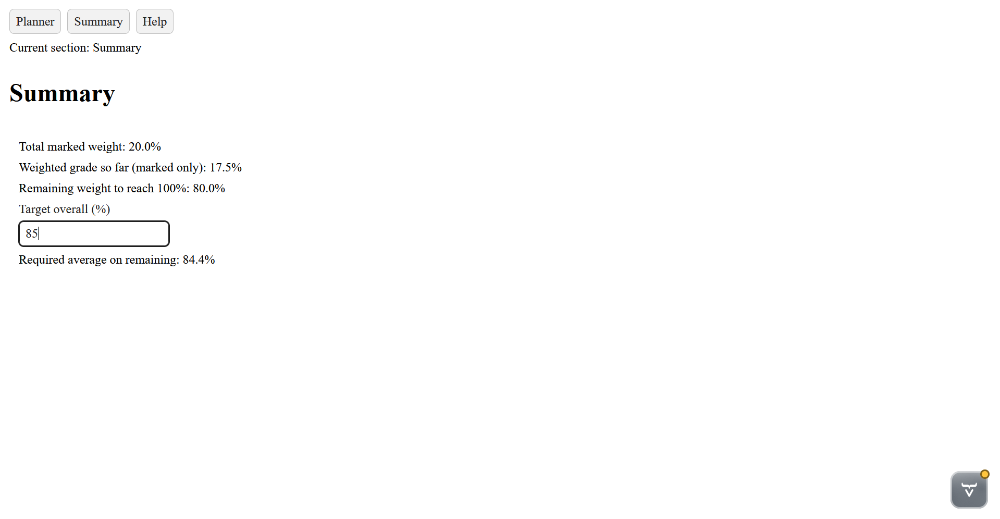
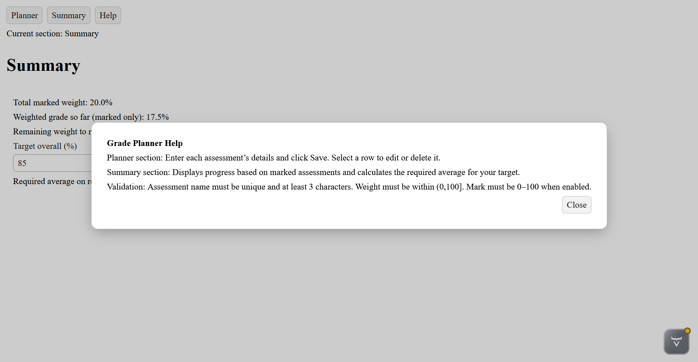

# Course Grade Planner
A Spring Boot + Vaadin grade planning web application that allows users to track course assessments, compute weighted progress, and determine required average to reach a desired grade.

## Features:
### Planner
- add, edit, and delete assessments
- Real time form validation using Vaadin binders
- Unique assessment name enforcement
- Conditional validation of all form fields
- Live Vaadin grid updates

### Summary
- Total marked weight
- Weighted grade so far (for marked assessments only)
- Remaining course weight
- Required course average calculator for a target final grade
- Live updates after all planner operations

### Help
- Modal dialog explaining app usage and validation rules
- Background interaction disabled while open

### Validation rules
- Name (all with unique error messages)
  - Required to be filled when submitted
  - Minimum 3 characters
  - Must be unique
- Weight
  - Required to be filled when submitted
  - Must be in the range (0, 100]
- Mark
  - Required only if the marked checkbox is checked
  - Must be in the range [0, 100]
  - Ignored and cleared if unmarked

## Architecture 
### Domain Layer:
Assessment.java
- Represents a graded course component
- Contains no UI logic

### Service Layer:
CoursePlannerService.java
- In-memory data storage 
- Handles save/delete
- Enforces uniqueness

GradeCalculator.java
- Stateless utility class
- Purely static methods
- Ignores unmarked assessment
- Handles edge cases (e.g. zero remaining weight)

### UI Layer:
HomeView.java
- Contains Planner, Summary, and Help sections
- Handles UI interactions and data binding

## Tech stack
- Java
- Spring Boot
- Vaadin
- Maven

## How to run
1. Clone the repository
2. Open in your IDE
3. Run the Spring Boot app
4. Open http://localhost:8080

## Screenshots
### Planner

### Summary

### Help

